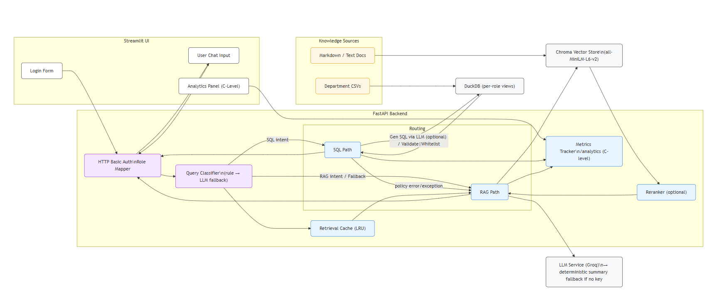

# FinSolve RBAC Chatbot

Role-aware Retrieval Augmented Generation (RAG) chatbot for multi-role enterprise teams. The assistant combines secure authentication, document retrieval, and structured analytics to eliminate data silos while keeping access compliant.



## System Walkthrough
1. **Streamlit UI (User Layer)**  
   - Presents login, chat, and the adaptive sidebar.  
   - Employees see their department tables; C-level users additionally see live analytics (query counts, cache size, reranker state).  
   - All chat prompts are sent to the FastAPI backend with the user's Basic Auth credentials.

2. **Authentication & Role Mapping (Gateway)**  
   - FastAPI verifies credentials via HTTP Basic and resolves the user's role.  
   - Unauthorized or cross-department requests are rejected with HTTP 403.  
   - The normalized role is attached to the request context for downstream policy checks.

3. **Query Classification (Router)**  
   - Heuristic classifier inspects each prompt for SQL cues (SELECT, table names) versus natural language intent.  
   - SQL-intent queries are routed to the structured engine; otherwise, the request defaults to the RAG pipeline.  
   - Ambiguous cases fall back to RAG to avoid leaking structured data unintentionally.

4. **Structured Path (DuckDB Engine)**  
   - Department CSVs are exposed as read-only DuckDB views (for example `finance_expenses`, `hr_performance`).  
   - Only single `SELECT` statements are allowed; joins, DDL, or multi-statements are blocked.  
   - Results are rendered as Markdown tables. Any policy violation or execution error pushes the request into the RAG fallback.

5. **RAG Path (Chroma + LLM)**  
   - Queries are scoped to department-specific embeddings stored in Chroma.  
   - The retrieval cache avoids recomputing embeddings for identical role/question pairs.  
   - Optional cross-encoder reranker (enabled with `ENABLE_RERANKER=true`) reorders results before the LLM generates the answer.  
   - When no Groq API key is set, a deterministic summary is returned for local testing.

6. **LLM Response & Analytics (Output Layer)**  
   - The LLM service (Groq or fallback) synthesizes the final response with citations.  
   - Each request updates the metrics tracker: per-role totals, mode (SQL/RAG/fallback), cache hits, reranker usage.  
   - `/analytics` exposes these metrics to C-level accounts and powers the Streamlit admin sidebar.

7. **Knowledge Sources**  
   - `resources/data/<department>/` holds markdown/text documents for RAG and CSV files for SQL.  
   - The folder layout ensures RBAC is enforced at ingestion (metadata tags), retrieval, and execution.

8. **Metrics Tracker & Analytics**
- The Metrics Tracker aggregates:

   - Total queries by role.

   - Breakdown of SQL vs. RAG vs. fallback.

   - Cache hit rate.

   - Reranker status.


A dedicated /analytics endpoint exposes this data to C-Level accounts, which is visualized in the Streamlit admin panel in real time.

## 🔐 Data Flow Summary

User logs in via Streamlit → authenticated with FastAPI.

Query classified → routed to SQL or RAG.

SQL executes over DuckDB (role-scoped views) → or RAG retrieves from Chroma.

Optional reranker improves relevance; LRU cache speeds up repeats.

LLM (Groq) generates the final answer → appended with citations and source type.

All interactions logged for metrics → visible to admins in real time.

## Features
- FastAPI backend with HTTP Basic authentication, centralized role mapping, and RBAC enforcement at retrieval time.  
- Chroma vector store with `all-MiniLM-L6-v2` embeddings for scoped RAG responses.  
- Groq LLM integration (`llama-3.1-8b-instant`) with a deterministic summary fallback when no API key is available.  
- DuckDB-backed SQL path for department CSV files with strict table filtering and automatic fallback to RAG on policy or execution failures.  
- Optional cross-encoder reranker (toggle with `ENABLE_RERANKER=true`) plus an in-memory LRU cache to avoid redundant lookups.  
- Streamlit chat UI featuring login, chat history, configurable retrieval depth, surfaced SQL table list, and source citations.  
- Built-in analytics endpoint (C-level only) reporting per-role usage, cache size, and reranker status-surface insights directly within the Streamlit sidebar.

## Quick Start
1. **Clone the repository**
   ```bash
   git clone https://github.com/<your-username>/rbac-agent.git
   cd rbac-agent
   ```
2. **Create a uv-managed virtual environment**
   ```bash
   uv venv .venv
   .venv\Scripts\activate          # Windows
   # source .venv/bin/activate     # macOS/Linux
   ```
3. **Install dependencies**
   ```bash
   uv pip sync requirements.lock
   # Regenerate the lock if you modify pyproject.toml:
   # uv pip compile pyproject.toml --output-file requirements.lock
   ```
4. **Configure environment variables**
   ```bash
   copy .env.example .env           # Windows
   # cp .env.example .env           # macOS/Linux
   ```
   Populate values such as:
   - `GROQ_API_KEY`: optional, enables Groq-hosted LLM responses.  
   - `FINCHAT_BACKEND_URL`: backend URL used by the Streamlit app (defaults to `http://localhost:8000`).  
   - `ENABLE_RERANKER`: set to `true` to load the optional cross-encoder reranker (defaults to `false`).

## Running the Backend
```bash
uvicorn app.main:app --reload
```
Endpoints:
- `GET /login` - validates credentials and returns the authenticated role.  
- `POST /chat` - routes through SQL or RAG with RBAC enforcement.  
- `GET /roles` - lists roles with their accessible departments.  
- `GET /structured-tables` - returns the SQL tables available to the caller's role.  
- `GET /analytics` - usage metrics for C-level accounts.  
- `GET /health` - readiness probe.

Embeddings are rebuilt at startup from `resources/data/<department>/`, and CSV assets are loaded into DuckDB views per department.

## Streamlit Chat UI
Launch in a separate terminal:
```bash
streamlit run streamlit_app.py
```
- Authenticate with any sample user (below) or your own credentials.  
- Ask natural-language questions or SQL queries; answers include source citations.  
- Adjust the `Top K` slider to control RAG context depth.  
- C-level users see live analytics in the sidebar after each request.

### Sample Credentials
| Username | Password     | Role        |
|----------|--------------|-------------|
| Tony     | password123  | engineering |
| Bruce    | securepass   | marketing   |
| Sam      | financepass  | finance     |
| Natasha  | hrpass123    | hr          |
| Priya    | cboard123    | c_level     |
| Anita    | employee123  | employee    |

## Sample Queries
- Give me a summary about system architecture. (engineering)
- Give me the details of employees in Data department whose performance rating is 5. (hr)
- What percentage of the Vendor Services expense was allocated to marketing-related activities? (finance)
- What is the Return on Investment (ROI) for FinSolve Technologies? (finance)
- Give me details about leave policies. (general)
- What was the percentage increase in FinSolve Technologies's net income in 2024? (finance)

## Project Structure
```
app/
|-- main.py               # FastAPI entrypoint
|-- schemas/              # Pydantic request/response models
|-- services/             # RBAC, RAG, SQL, cache, reranker, metrics
resources/
|-- data/                 # Department-specific knowledge base (markdown + CSV)
`-- architecture.png      # System architecture diagram
streamlit_app.py          # Streamlit front-end
pyproject.toml            # Dependency management
requirements.lock         # Resolved dependency lock (generated by uv)
.env.example              # Sample environment configuration
tools/architecture.mmd    # Mermaid source for the architecture diagram
```

## Testing
```bash
uv run pytest
```
The suite covers classifier heuristics, cache behaviour, analytics/authorization rules, SQL policy enforcement, and the `/chat` endpoint SQL happy path for the HR role.

## Docker
Build and run the combined FastAPI + Streamlit stack inside a single container:
```bash
docker build -t finsolve-rbac .
docker run -p 8000:8000 -p 8501:8501 --env-file .env finsolve-rbac
```
The container exposes FastAPI on port `8000` and Streamlit on port `8501`. Pass your `.env` (containing `GROQ_API_KEY`, etc.) via `--env-file` or individual `-e` flags.

## Offline Evaluation
```bash
uv run python tools/offline_eval.py --dataset eval_samples.json --output results/eval.csv
```
Seed `eval_samples.json` with role-specific prompts and expected keywords to track groundedness/keyword precision. The evaluator runs entirely offline using FastAPI’s TestClient.

## Extending the Solution
- Update role mappings in `app/services/role_manager.py` to add departments or refine RBAC.  
- Add markdown documents to `resources/data/<department>` to expand the RAG knowledge base.  
- Place CSV assets under the same department folder to extend DuckDB-powered analytics.  
- Adjust embeddings or vector store settings in `app/services/rag_service.py` if needed.  
- Extend `app/services/reranker.py` to integrate third-party rerankers (for example, Cohere).  
- Persist metrics from `app/services/metrics.py` or `/analytics` to external observability tools.

> **Note:** Without a `GROQ_API_KEY`, the chatbot returns deterministic summaries composed from retrieved chunks, keeping the application usable for local development.
